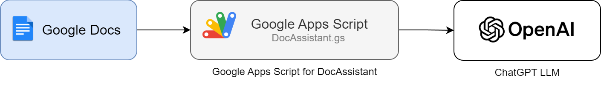
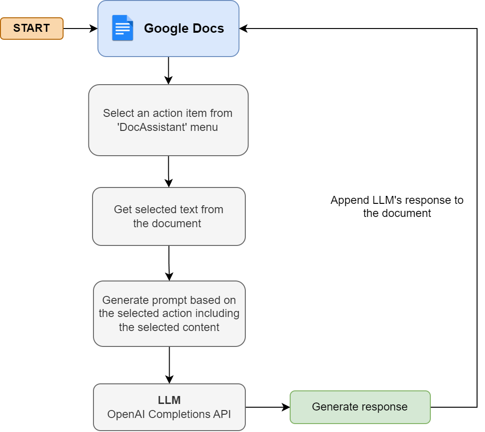

# DocAssistant

This **Google Apps Script** injects an AI-powered writing assistant in **Google Docs**. The script is powered by OpenAI's **Chat Completions API**.

## Table of Contents

* [Key Features](#key-features)
    * [Demo](#demo)
* [System Architecture](#system-architecture)
* [End-to-End Flow](#end-to-end-flow)
* [Usage](#usage)

## Key Features

The tool provides these features within Google Docs:

1. **Generate Ideas**: Generate 10 ideas based on input text.
2. **Generate Essay**: Generates ~400 essay based on prompt.
3. **Summarize Text**: Summarize given text.
4. **Generate Social Media Posts**: Generate text for social media posts on Twitter, Linkedin and Instagram.

### Demo

Watch the demo video below to see this tool in action:

[doc-assistant-demo.webm](https://github.com/LostInCode404/doc-assistant/assets/15314796/234c84db-fa6b-41fb-91fa-cf0f9b1b2577)

## System Architecture

**Components**

1. **Google Docs**: Google Docs serve as the starting point where you can use this tool.
2. **Google Apps Script**: The `DocAssistant.gs` script adds a new menu item "DocAssistant" and sub menus for different features within Google Docs. The script invokes OpenAI Chat Completions API with a prompt that includes details about the selected feature and the selected text.
3. **OpenAI Chat Completions API**: The OpenAI API generates the content as requested by user. I used `gpt-3.5-turbo` model for the demo, see [Usage](#usage) section for using a different model.

&nbsp; 

## End-to-End Flow

1. **User Input**: User selects some text and selects one of features from the "DocAssistannt" menu.
2. **Generate Prompt**: The `DocAssistant.gs` script generates a prompt based on the selected feature and the selected text.
3. **Invoke OpenAI Chat Completions API**: The script invokes the OpenAI Chat Completions API with the generated prompt.
4. **Update Document**: The script appends the LLMs response at the end of the document.

&nbsp; 

&nbsp; 

## Usage

1. Open any document in Google Docs and go to: Extensions > Apps Script.
2. Add the Google Apps Script ([DocAssistant.gs](DocAssistant.gs)) to your project.
3. Set script properties:
    - `OPENAI_API_KEY`: Set your OpenAI key 
    - `OPENAI_MODEL`: Set model name (Default is `gpt-3.5-turbo`)
3. `DocAssistant` menu will appear in the Google Docs menu bar.

